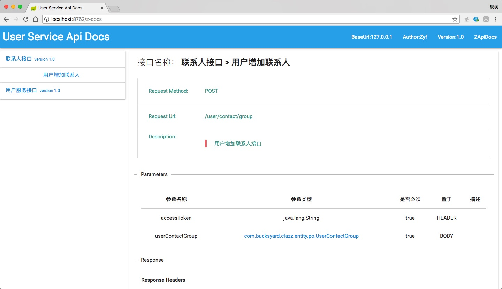

# ZApiDocs

> A tool that automatically generate API documents for Springboot
>
> Springboot的一个自动生成API文档的工具
>
> 写此工具的原因比较简单，在我用SpringBoot的时候，和前端沟通之中发现自己写文档太麻烦，比较费事儿，按照码农的想法就是找个工具做这个事儿，然后发现，这些工具要么是不太好用，要么是好用但是太丑（虽然我做的也丑，但是我看着得劲，哈哈😝），所以正好学习学习，就照葫芦画瓢来自己干了一个，鄙人才疏学浅，难免各种bug各种漏洞以及各种丑，欢迎来吐槽，但轻点啦，谢谢，在文末会将本次我学习用到的文档列出来，感谢各位大神在前面的道路付出的努力，为我们后来者提供了学习的便利与机会，谢谢

## 介绍

​	ZApiDocs是一个利用注解来进行构建API文档的小工具（后续会慢慢将注解减少），你只用添加几个简单的注解就可以在Springboot中生成API在线文档，极大的减少了后端码农撰写文档的时间以及精力。


## 使用

### jar

`zApiDocs/jar/z-api-docs-1.0.jar`

### Maven

*审核中，审核完成上传后就可以用了*

### 注解

> ZApiDocs中有如下一些注解，我将一一说明作用

#### `@ZApi`

* 作用域：`ElementType.TYPE`

* 作用：标志此类为一个接口

* 参数值：

  |   参数名    |     参数类型     |     说明     | 默认值 |
  | :---------: | :--------------: | :----------: | :----: |
  |    name     | java.lang.String |   类的名称   |   ""   |
  | description | java.lang.String | 类的详细介绍 |   ""   |
  |   author    | java.lang.String |     作者     |   ""   |
  |   version   | java.lang.String |    版本号    | "1.0"  |

* 完整示例

  ```java
  @ZApi(name="用户信息接口", description="用于处理用户相关信息的接口", author="Zyf", version="1.0")
  @RestController
  public class UserController{
  	...
  }
  ```

---

#### `@ZApiMethod`

* 作用域：`ElementType.METHOD`

* 作用：标志此方法为一个请求方法

* 参数值：

  |   参数名    |                       参数类型                        |      说明      | 默认值 |
  | :---------: | :---------------------------------------------------: | :------------: | :----: |
  |    name     |                   java.lang.String                    |    接口说明    |   ""   |
  | description |                   java.lang.String                    | 接口的详细描述 |   ""   |
  |     url     |                  java.lang.String[]                   |    接口地址    |   ""   |
  |   method    | org.springframework.web.bind.annotation.RequestMethod |    请求方法    |  GET   |

* 完整示例

  ```java
  @ZApi(name="用户信息接口", description="用于处理用户相关信息的接口", author="Zyf", version="1.0")
  @RestController
  public class UserController{
  	
      @ZApiMethod(name="根据用户的Id获取用户信息", description="获取用户的详细信息", url={"/user/{id}"}, method=RequestMethod.GET)
      @GetMapping("/user/{id}")
      public User getUserInfoById(){
      	...
      }
  }
  ```

---

#### `@ZApiParam`

* 作用域：`ElementType.PARAMETER`

* 作用：标志此参数为一个参数

* 参数值：

  |   参数名    |                     参数类型                      |         说明         | 默认值 |
  | :---------: | :-----------------------------------------------: | :------------------: | :----: |
  |    name     |                 java.lang.String                  |       参数名称       |   ""   |
  |  dataType   |                java.lang.Class<T>                 |   参数类型（必填）   |        |
  | description |                 java.lang.String                  |       参数描述       |   ""   |
  |  required   |                      boolean                      |       是否必须       |  true  |
  |  paramType  | com.zyflovelam.zapi.docs.annotation.ZApiParamType | 参数来源类型（必填） |        |

* 完整示例

  ```java
  @ZApi(name="用户信息接口", description="用于处理用户相关信息的接口", author="Zyf", version="1.0")
  @RestController
  public class UserController{
  	
      @ZApiMethod(name="根据用户的Id获取用户信息", description="获取用户的详细信息", url={"/user/{id}"}, method=RequestMethod.GET)
      @GetMapping("/user/{id}")
      public User getUserInfoById(@ZApiParam(name="用户Id", dataType=String.class, description="用户获取到的Id", required=true, paramType=ZApiParamType.PATH) @PathVariable("id") String id){
      	...
      }
  }
  ```

---

#### `@ZApiResponses`

* 作用域：`ElementType.METHOD`

* 作用：标志此方法的返回参数

* 参数值：

  |       参数名        |                         参数类型                         |      说明      | 默认值 |
  | :-----------------: | :------------------------------------------------------: | :------------: | :----: |
  |    zApiResponses    |    com.zyflovelam.zapi.docs.annotation.ZApiResponse[]    | 返回值（必填） |        |
  | zApiResponseHeaders | com.zyflovelam.zapi.docs.annotation.ZApiResponseHeader[] |     返回头     |   {}   |

* 完整示例：

  ```java
  @ZApi(name="用户信息接口", description="用于处理用户相关信息的接口", author="Zyf", version="1.0")
  @RestController
  public class UserController{
  	
      @ZApiMethod(name="根据用户的Id获取用户信息", description="获取用户的详细信息", url={"/user/{id}"}, method=RequestMethod.GET)
      @ZApiResponses(
          zApiResponses={
  	    	@ZApiResponse(/*详细见下文*/)
      	},
          zApiResponseHeaders={
          	@ZApiResponseHeader(/*详细见下文*/)
          }
      )
      @GetMapping("/user/{id}")
      public User getUserInfoById(@ZApiParam(name="用户Id", dataType=String.class, description="用户获取到的Id", required=true, paramType=ZApiParamType.PATH) @PathVariable("id") String id){
      	...
      }
  }
  ```

---

#### `@ZApiResponse`

* 作用域：`ElementType.PARAMETER`

* 作用：返回信息

* 参数值：

  |    参数名    |      参数类型      |    说明    |   默认值   |
  | :----------: | :----------------: | :--------: | :--------: |
  |     code     |        int         |   返回码   |    200     |
  |   message    |  java.lang.String  |  返回消息  |     ""     |
  | responseBody | java.lang.Class<T> | 返回体类型 | Void.class |

* 完整示例：

  ```java
  @ZApi(name="用户信息接口", description="用于处理用户相关信息的接口", author="Zyf", version="1.0")
  @RestController
  public class UserController{
  	
      @ZApiMethod(name="根据用户的Id获取用户信息", description="获取用户的详细信息", url={"/user/{id}"}, method=RequestMethod.GET)
      @ZApiResponses(
          zApiResponses={
  	    	@ZApiResponse(code=200, message="success", responseBody=User.class)
      	}
      )
      @GetMapping("/user/{id}")
      public User getUserInfoById(@ZApiParam(name="用户Id", dataType=String.class, description="用户获取到的Id", required=true, paramType=ZApiParamType.PATH) @PathVariable("id") String id){
      	...
      }
  }
  ```

---

#### `@ZApiResponseHeader`

* 作用域：`ElementType.PARAMETER`

* 作用：返回头信息

* 参数值：

  |   参数名    |     参数类型     |     说明     | 默认值 |
  | :---------: | :--------------: | :----------: | :----: |
  |    name     | java.lang.String |  返回头名称  |   ""   |
  |    value    | java.lang.String |  返回头的值  |   ""   |
  | description | java.lang.String | 返回头的描述 |   ""   |

* 完整示例

  ```java
  @ZApi(name="用户信息接口", description="用于处理用户相关信息的接口", author="Zyf", version="1.0")
  @RestController
  public class UserController{
  	
      @ZApiMethod(name="根据用户的Id获取用户信息", description="获取用户的详细信息", url={"/user/{id}"}, method=RequestMethod.GET)
      @ZApiResponses(
          zApiResponseHeaders={
          	@ZApiResponseHeader(name="Content-Type", value="text/json,charset=UTF-8", description="内容类别")
          }
      )
      @GetMapping("/user/{id}")
      public User getUserInfoById(@ZApiParam(name="用户Id", dataType=String.class, description="用户获取到的Id", required=true, paramType=ZApiParamType.PATH) @PathVariable("id") String id){
      	...
      }
  }
  ```

---

#### `@ZApiEntity`

* 作用域：`ElementType.TYPE`

* 作用：标志此类为文档中的某个实体，现在版本没有将Response中的实体自动添加到API实体列表中，所以需要开发人员自己标记哪些类为返回的实体类。

* 参数值：

  | 参数名  |     参数类型     |      说明      | 默认值 |
  | :-----: | :--------------: | :------------: | :----: |
  |  value  | java.lang.String | 实体类描述信息 |   ""   |
  | author  | java.lang.String |      作者      |   ""   |
  | version | java.lang.String |     版本号     | "1.0"  |

* 完整示例：

  ```java
  @ZApiEntity(value="用户类", author="Zyf", version="1.0")
  public class User{
      ...
  }
  ```

---

#### `@ZApiEntityField`

* 作用域：`ElementType.FIELD`

* 作用：将此字段标志为字段，若`@ZApiEntity`中未有任何一个字段添加`@ZApiEntityField`注解，则将所有的字段进行统计封装入文档

* 参数值：

  | 参数名 |     参数类型     |     说明     | 默认值 |
  | :----: | :--------------: | :----------: | :----: |
  | value  | java.lang.String | 字段描述信息 |   ""   |

* 完整示例

  ```java
  @ZApiEntity(value="用户类", author="Zyf", version="1.0")
  public class User{
      @ZApiEntityField("用户Id")
      private String id;
      @ZApiEntityField("用户名字")
      private String name;
      @ZApiEntityField("年龄")
      private int age;
      
      ...getter,setter
  }
  ```

---

#### 其他

##### `ZApiParamType`

```java
public enum ZApiParamType {
    HEADER, BODY, QUERY, PATH, FORM
}
```

### 配置

使用Springboot并且在Application中进行配置注入Bean即可：

```java
@SpringBootApplication
public class XXXApplication{
    public static void main(String[] args) {
        SpringApplication.run(XXXApplication.class, args);
    }
    
    @Bean
    public ZApiConfig zApiConfig() {
        return new ZApiConfig("com.xxx",/*要扫描的包名*/
                new ApiInfo()/*API文档的信息*/
                        .setTitle("接口文档")
                        .setDescription("生成的接口文档")
                        .setVersion("1.0")
                        .setAuthor("Zyf")
                        .setBaseUrl("127.0.0.1")
        );
    }
}
```

### 访问

访问地址：`${ip}:${port}/z-docs`


---



